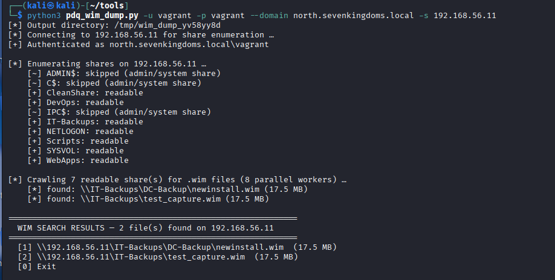
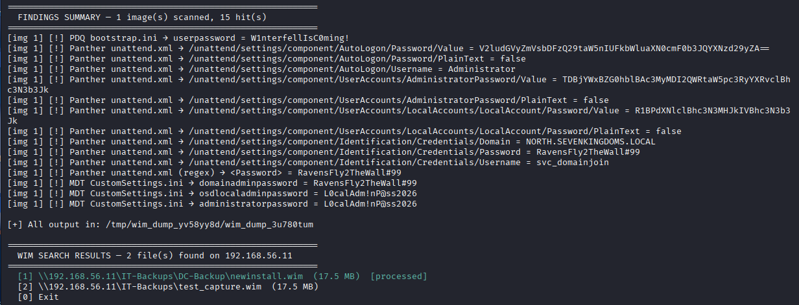

# wim_dump.py

Download Windows imaging (`.wim`) files from SMB shares, hunt them for cleartext
credentials, and dump SAM / LSA / NTDS secrets from the captured image — all in
one pass.

Deployment shares (MDT, WDS, PDQ, SCCM) and gold-image repositories are a
recurring source of domain credentials: sysprep answer files, deploy bootstrap
scripts, and registry hives baked into captured images routinely contain
plaintext local-admin or domain-join passwords. `wim_dump.py` automates finding
those images, pulling the credential-bearing files out of them, and running
`secretsdump` against any hives inside.

---

## What it does

1. **Acquires the WIM** - either a specific UNC path you give it, or by crawling
   every readable share on a host to discover `.wim` files and letting you pick.
2. **Enumerates images** - a single `.wim` can hold multiple images (indexes);
   each is scanned independently.
3. **Extracts credential files** from each image using two strategies:
   - a fixed list of well-known paths (sysprep answer files, deploy scripts,
     registry hives, `NTDS.dit`), and
   - a full-image filename sweep that catches deploy creds sitting at
     non-standard paths or casings the fixed list would miss.
1. **Parses** the extracted files for cleartext secrets - INI/INF (`bootstrap.ini`,
   `CustomSettings.ini`, `sysprep.inf`) and unattend XML (`AutoLogon`,
   `AdministratorPassword`, domain-join accounts), with a regex fallback for
   malformed XML.
2. **Runs secretsdump** against any extracted hives — local SAM/LSA secrets from
   `SAM`+`SYSTEM`(+`SECURITY`), or a full AD dump when a DC's `NTDS.dit`+`SYSTEM`
   are present.
3. **Summarizes** every plaintext hit across all images at the end.

---

## Requirements

- **Python 3** with **impacket** — SMB transport + `secretsdump`
  ```bash
  pip install impacket
  ```
- **wimlib** — provides `wimlib-imagex` for listing/extracting WIM contents
  ```bash
  sudo apt install wimtools
  ```
- **impacket-secretsdump** on `PATH` (installed by Kali's impacket package). If
  it isn't found, the tool falls back to `python -m impacket.examples.secretsdump`.

---

## Usage

### Process a specific WIM from a share

```bash
python3 wim_dump.py '\\192.168.1.10\share\images\capture.wim' \
    -u DOMAIN\\administrator -p 'Password1'
```

### Discover WIMs on a host, then pick one (or several)

Crawls every readable, non-admin share for `.wim` files and prompts you to
select which to download and process:

```bash
python3 wim_dump.py --search 192.168.1.10 \
    -u DOMAIN\\administrator -p 'Password1'
```

At the selection prompt you can enter a single number, a comma/space list
(`1,3,5`), a range (`1-4`), a mix (`1,3-5`), `all`, or `0` to exit. Files that
look like OS/component plumbing (WinRE, WinSxS, reset images) are flagged as
*likely noise*, and files already processed this run are marked green.

### Process a WIM already on disk

```bash
python3 wim_dump.py /loot/capture.wim --no-download
```

### Pass-the-hash instead of a password

```bash
python3 wim_dump.py '\\10.0.0.5\deploy\gold.wim' \
    -u administrator --hash <NThash> --domain CORP
```

### Scan only one image index inside a multi-image WIM

```bash
python3 wim_dump.py '\\host\share\install.wim' \
    -u admin -p 'Password1' --image-index 3
```

---

## Options

| Option | Description |
|--------|-------------|
| `wim_unc` | UNC or local path to a `.wim` (omit when using `--search`) |
| `-s`, `--search HOST` | Crawl all readable shares on HOST for `.wim` files, then prompt for selection |
| `--threads N` | Parallel share-crawl workers for `--search` (default: 8) |
| `--include-admin-shares` | Also crawl `C$`/`ADMIN$` during `--search` (default: skipped — whole-volume, slow, noisy) |
| `-u`, `--username` | Username; accepts `DOMAIN\user` form (splits into domain automatically) |
| `-p`, `--password` | Password |
| `--hash NTHASH` | NT hash for pass-the-hash |
| `--domain` | Domain (or supply it via `DOMAIN\user` in `--username`) |
| `--image-index N` | Scan a single image index only (default: all images in the WIM) |
| `--out DIR` | Output directory (default: an auto-created temp dir) |
| `--no-download` | Treat `wim_unc` as a local path and skip the SMB download |

---

## Output

Everything for a run is written under the output directory (`--out`, or an
auto-created `wim_dump_*` temp dir, printed at startup):

- The downloaded `capture.wim` (unless `--no-download`).
- `image_<index>/` — extracted credential files, one isolated subdirectory per
  source path so same-named files (e.g. two `unattend.xml`) never collide.
- `image_<index>/secretsdump.txt` — full secretsdump output for that image.
- A consolidated **findings summary** printed to the terminal, tagged by image
  index, listing every plaintext credential hit.

---

## Files it hunts for

**Answer files / deploy scripts (cleartext passwords):**
`unattend.xml`, `autounattend.xml`, `sysprep.inf`, `sysprep.xml`,
`bootstrap.ini`, `CustomSettings.ini`, `LiteTouch.ini` — matched at both their
canonical paths and anywhere in the image by filename.

**Registry hives (hashes + LSA secrets):**
`SAM`, `SYSTEM`, `SECURITY` from `\Windows\System32\config\`.

**Domain controller captures (full AD dump):**
`NTDS.dit` + `SYSTEM` → complete domain hash dump via secretsdump.

---

## Example

